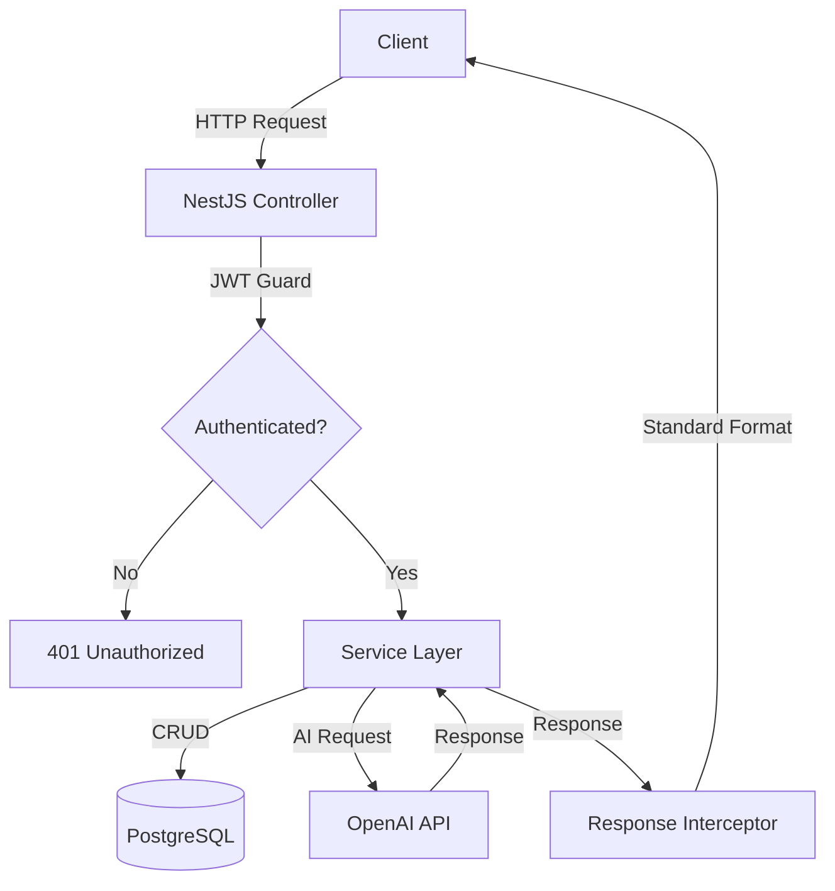
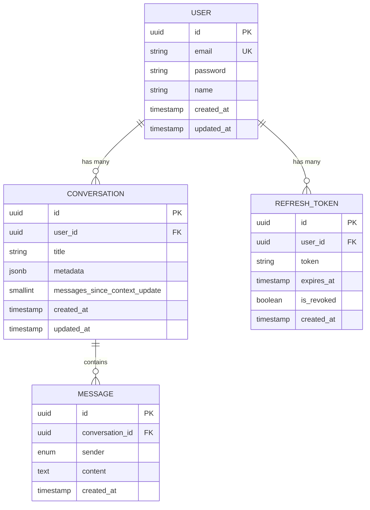

# AI Sales Chat - Backend API

Robust REST API built with NestJS that simulates an **Intelligent Sales Assistant** integrated with OpenAI. Complete system with JWT authentication, conversation management, and evolutionary metadata to optimize interaction context.

---

## 📋 Table of Contents

- [Features](#-features)
- [Tech Stack](#-tech-stack)
- [Prerequisites](#-prerequisites)
- [Installation and Setup](#-installation-and-setup)
- [Local Execution](#️-local-execution)
- [Database Migrations](#️-database-migrations)
- [API Endpoints](#-api-endpoints)
- [Project Architecture](#-project-architecture)
- [Evolutionary Metadata System](#-evolutionary-metadata-system)

---

## ✨ Features

- ✅ JWT Authentication with refresh tokens
- ✅ User registration with email/phone validation
- ✅ Multiple conversations per user
- ✅ OpenAI integration (gpt-4o-mini) for intelligent responses
- ✅ Evolutionary metadata with 3-message threshold
- ✅ Automatic cleanup of expired tokens (cron jobs)
- ✅ Centralized error and response handling
- ✅ Optimized indexes for fast queries
- ✅ Clean architecture following SOLID principles

---

## 🛠 Tech Stack

**Backend:**
- Node.js 18+
- NestJS 10.x
- TypeScript 5.x
- PostgreSQL 15+
- TypeORM 0.3.x
- OpenAI API (gpt-4o-mini)
- JWT + bcrypt

---

## 📦 Prerequisites
```bash
node -v  # v18.0.0 or higher
npm -v   # v9.0.0 or higher
docker -v # 20.10.0 or higher (optional, for PostgreSQL)
```

---

## 🚀 Installation and Setup

### 1. Clone the repository
```bash
git clone <repository-url>
cd 1to1-ai-chat/backend
```

### 2. Install dependencies
```bash
npm install
```

### 3. Configure environment variables

Create a `.env` file in the root directory:
```env
# Server
PORT=3000
NODE_ENV=development

# Database
DB_HOST=localhost
DB_PORT=5432
DB_USERNAME=postgres
DB_PASSWORD=postgres
DB_DATABASE=sales_chat_db

# JWT
JWT_SECRET=your-super-secret-jwt-key-change-this-in-production
JWT_EXPIRES_IN=15m
JWT_REFRESH_SECRET=your-super-secret-refresh-key-change-this-in-production
JWT_REFRESH_EXPIRES_IN=7d

# OpenAI
OPENAI_API_KEY=sk-your-openai-api-key

# CORS
CORS_ORIGIN=http://localhost:5173
```

### 4. Setup PostgreSQL

**Option A - With Docker (Recommended):**
```bash
docker-compose up -d
```

**Option B - Local installation:**
```bash
# Install PostgreSQL 15+
# Create database
psql -U postgres
CREATE DATABASE sales_chat_db;
\q
```

---

## ▶️ Local Execution
```bash
# Development with hot-reload
npm run start:dev

# Production
npm run build
npm run start:prod

# Server will be available at http://localhost:3000
```

---

## 🗄️ Database Migrations

### Generate a new migration
```bash
npm run migration:generate -- src/database/migrations/MigrationName
```

### Run pending migrations
```bash
npm run migration:run
```

### Revert last migration
```bash
npm run migration:revert
```

### Show migration status
```bash
npm run migration:show
```

---

## 🌐 API Endpoints

### Authentication

| Method | Route | Auth | Description |
|--------|------|------|-------------|
| POST | `/auth/login` | ❌ | User login |
| POST | `/auth/refresh` | ❌ | Refresh access token |
| POST | `/auth/logout` | ❌ | Logout (revokes refresh token) |
| POST | `/auth/logout-all` | ✅ | Logout from all user sessions |
| GET | `/auth/me` | ✅ | Get authenticated user profile |

**Example - Login:**
```bash
curl -X POST http://localhost:3000/auth/login \
  -H "Content-Type: application/json" \
  -d '{
    "email": "user@example.com",
    "password": "password123"
  }'
```

**Response:**
```json
{
  "success": true,
  "message": "Login successful",
  "data": {
    "accessToken": "eyJhbGciOiJIUzI1NiIsInR5cCI6IkpXVCJ9...",
    "refreshToken": "eyJhbGciOiJIUzI1NiIsInR5cCI6IkpXVCJ9...",
    "user": {
      "id": "uuid",
      "email": "user@example.com",
      "name": "John Doe"
    }
  }
}
```

### Users

| Method | Route | Auth | Description |
|--------|------|------|-------------|
| POST | `/users/register` | ❌ | Register new user |
| GET | `/users/check?email=` | ❌ | Check email availability |
| GET | `/users/profile` | ✅ | Get user profile |

**Example - Register:**
```bash
curl -X POST http://localhost:3000/users/register \
  -H "Content-Type: application/json" \
  -d '{
    "email": "newuser@example.com",
    "password": "password123",
    "name": "Jane Doe"
  }'
```

### Chat

| Method | Route | Auth | Description |
|--------|------|------|-------------|
| POST | `/chat/send` | ✅ | Send message (creates or continues conversation) |
| GET | `/chat/conversations` | ✅ | List user conversations |
| GET | `/chat/conversations/:id/history` | ✅ | Get conversation history |
| PATCH | `/chat/conversations/:id/title` | ✅ | Update conversation title |
| DELETE | `/chat/conversations/:id` | ✅ | Delete conversation |

**Example - Send message (new conversation):**
```bash
curl -X POST http://localhost:3000/chat/send \
  -H "Authorization: Bearer YOUR_ACCESS_TOKEN" \
  -H "Content-Type: application/json" \
  -d '{
    "content": "Hi, I am looking for a laptop for programming"
  }'
```

**Response:**
```json
{
  "success": true,
  "message": "Message sent successfully",
  "data": {
    "conversation": {
      "id": "conversation-uuid",
      "title": "Programming Laptop Search"
    },
    "userMessage": {
      "id": "message-uuid",
      "content": "Hi, I am looking for a laptop for programming",
      "sender": "user",
      "createdAt": "2025-01-15T10:30:00Z"
    },
    "botMessage": {
      "id": "message-uuid",
      "content": "Great! To help you better, could you tell me what type of programming you mainly do?",
      "sender": "bot",
      "createdAt": "2025-01-15T10:30:02Z"
    }
  }
}
```

**Example - Continue conversation:**
```bash
curl -X POST http://localhost:3000/chat/send \
  -H "Authorization: Bearer YOUR_ACCESS_TOKEN" \
  -H "Content-Type: application/json" \
  -d '{
    "conversationId": "conversation-uuid",
    "content": "Mainly web development with React and Node.js"
  }'
```

---

## 🏗 Project Architecture
```
backend/
├── src/
│   ├── common/                      # Shared utilities
│   │   ├── decorators/             # Custom decorators
│   │   │   └── get-user.decorator.ts
│   │   ├── filters/                # Exception filters
│   │   │   └── http-exception.filter.ts
│   │   ├── guards/                 # Custom guards
│   │   ├── helpers/                # Helper functions
│   │   │   ├── response-helper.ts
│   │   │   └── time.helper.ts
│   │   └── interceptors/           # Interceptors
│   │       └── response.interceptor.ts
│   │
│   ├── database/                    # Database configuration
│   │   ├── entities/               # TypeORM entities
│   │   │   ├── user.entity.ts
│   │   │   ├── refresh-token.entity.ts
│   │   │   ├── conversation.entity.ts
│   │   │   └── message.entity.ts
│   │   └── migrations/             # Migrations
│   │
│   ├── interfaces/                  # TypeScript interfaces
│   │   ├── api-response.interface.ts
│   │   └── search.interface.ts
│   │
│   ├── modules/                     # Application modules
│   │   ├── auth/                   # Authentication and authorization
│   │   │   ├── dto/
│   │   │   │   ├── login.dto.ts
│   │   │   │   └── refresh-token.dto.ts
│   │   │   ├── guards/
│   │   │   │   └── jwt-auth.guard.ts
│   │   │   ├── strategies/
│   │   │   │   └── jwt.strategy.ts
│   │   │   ├── auth.controller.ts
│   │   │   ├── auth.service.ts
│   │   │   ├── auth.module.ts
│   │   │   └── token-cleanup.service.ts
│   │   │
│   │   ├── chat/                   # Conversation management
│   │   │   ├── dto/
│   │   │   │   └── send-chat-message.dto.ts
│   │   │   ├── chat.controller.ts
│   │   │   ├── chat.service.ts
│   │   │   └── chat.module.ts
│   │   │
│   │   ├── openai/                 # OpenAI integration
│   │   │   ├── openia.service.ts
│   │   │   └── openia.module.ts
│   │   │
│   │   └── users/                  # User management
│   │       ├── dto/
│   │       │   ├── create-user.dto.ts
│   │       │   └── user.query.ts
│   │       ├── users.controller.ts
│   │       ├── users.service.ts
│   │       └── users.module.ts
│   │
│   ├── app.controller.ts
│   ├── app.module.ts
│   ├── app.service.ts
│   └── main.ts                     # Entry point
│
├── docker-compose.yml              # Containerized PostgreSQL
├── package.json
├── tsconfig.json
└── .env                            # Environment variables
```

### Data Flow


---

## 🧠 Evolutionary Metadata System

The system implements an intelligent context management approach that optimizes OpenAI token usage:

### Threshold Mechanism (3 messages)

**Messages 1-3 (Initial construction):**
```
Msg 1: counter = 2
  └─> Generate title + respond

Msg 2: counter = 4
  └─> Analyze msg 1 (user+bot) + msg 2 (user) → respond

Msg 3: counter = 6 → THRESHOLD REACHED
  └─> Analyze msgs 1-2-3 → GENERATE INITIAL METADATA → reset counter = 0
```

**Messages 4-6 (Use and update):**
```
Msg 4: counter = 2
  └─> Use existing metadata → respond

Msg 5: counter = 4
  └─> Analyze msg 4 + metadata → respond

Msg 6: counter = 6 → THRESHOLD REACHED
  └─> Analyze msgs 4-5 + metadata → UPDATE METADATA → reset counter = 0
```

### Metadata Structure
```typescript
interface ConversationMetadata {
  interests: string[];              // Customer interests
  offeredProducts: string[];        // Offered products
  rejectedProducts: string[];       // Rejected products
  saleStatus: 'exploring' | 'interested' | 'negotiating' | 'closed' | 'lost';
  lastIntent?: string;              // Last detected intent
}
```

### Practical Example
```json
{
  "interests": ["laptop", "web programming", "high performance"],
  "offeredProducts": ["MacBook Pro M3", "Dell XPS 15"],
  "rejectedProducts": ["Chromebook"],
  "saleStatus": "interested",
  "lastIntent": "compare technical specifications"
}
```

### System Advantages

1. **Token Optimization:** Instead of sending full history on each message, compressed metadata is sent
2. **Evolutionary Context:** Metadata updates every 3 exchanges, maintaining relevance
3. **Scalability:** Works efficiently with long conversations
4. **Analytics:** Enables reports and analytics on sales trends

---

## 🔒 Security

- Passwords hashed with bcrypt (salt rounds: 10)
- JWT with short expiration (15 minutes)
- Refresh tokens with long expiration (7 days)
- Revoked tokens stored for audit
- Automatic cleanup of expired tokens
- CORS configured for specific origins
- DTO validation with class-validator
- Guards protecting sensitive endpoints

---

## 📊 Database

### Entity Diagram


### Optimized Indexes
```sql
-- Users
CREATE INDEX idx_user_email ON users(email);

-- Refresh Tokens
CREATE INDEX idx_refresh_token_user ON refresh_tokens(user_id);
CREATE INDEX idx_refresh_token_expires ON refresh_tokens(expires_at);

-- Conversations
CREATE INDEX idx_conversation_user ON conversations(user_id);
CREATE INDEX idx_conversation_updated ON conversations(updated_at);
CREATE INDEX idx_conversation_user_created ON conversations(user_id, created_at);

-- Messages
CREATE INDEX idx_message_conversation ON messages(conversation_id);
CREATE INDEX idx_message_created ON messages(created_at);
```


---

## 📝 Code Conventions

- **Commits:** Conventional Commits (`feat:`, `fix:`, `refactor:`, etc.)
- **Naming:** camelCase for variables/functions, PascalCase for classes
- **Principles:** SOLID, Clean Code, DRY
- **DTOs:** Exhaustive validation with class-validator
- **Responses:** Standard format with ResponseHelper
- **Errors:** Centralized handling with HttpExceptionFilter

---

## 🚀 Deployment

### Backend (Render/Railway)
```bash
# Build
npm run build

# Start
npm run start:prod
```

**Required environment variables:**
- All variables from `.env` file
- Adjust `DB_HOST` and `CORS_ORIGIN` according to environment

---

## 📄 License

This project was developed as a technical test for 1to1 AI.

---

## 👨‍💻 Author

**Martín** - Full Stack Developer